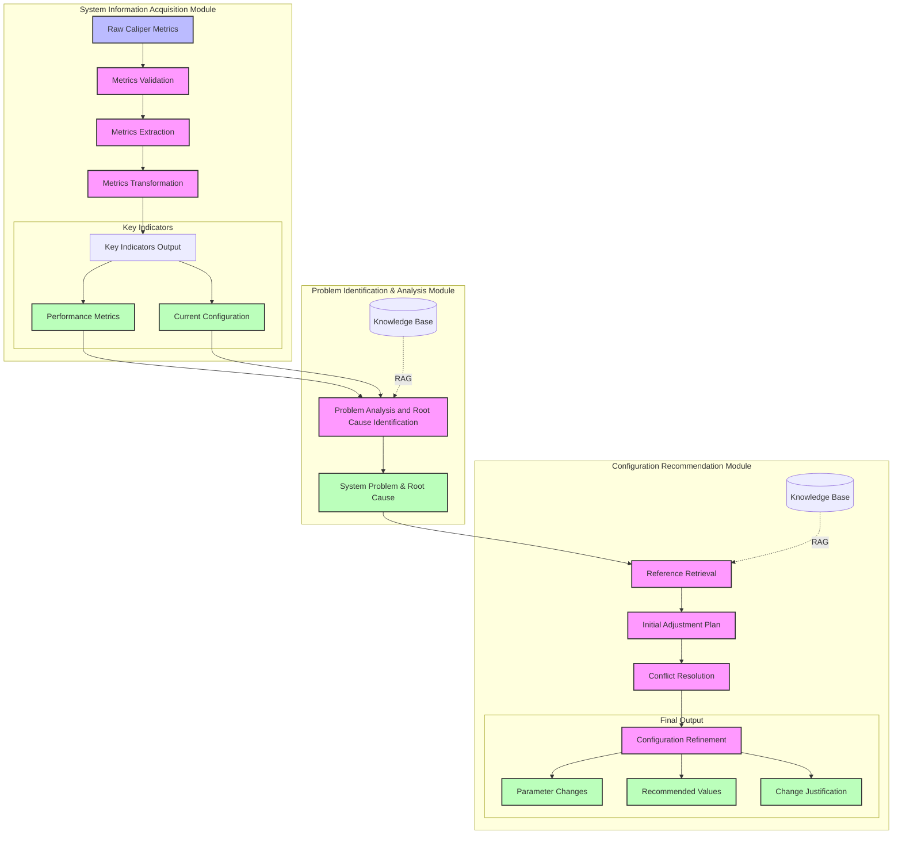
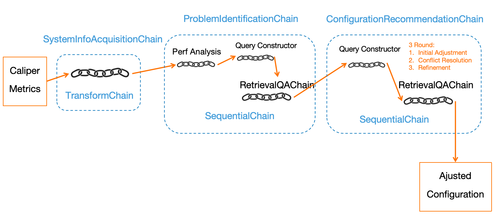

## LLM Agent for Hyperledger Fabric Parameter Adjustment

### 1 **General Workflow**

Acquire system info → Identify problem and analyze reason → Generate recommended configuration

### 2 **Core Modules**

1. **System Information Acquisition Module**

   Acquire system info  

   - Input: Raw Caliper metrics.  
   - Output: Key indicators (performance metrics and current configuration).  

2. **Problem Identification & Analysis Module**

   Identify problem and analyze reason  

   - Input: Key indicators.  
   - Output: System problem and problem reason.  

3. **Configuration Recommendation Module**

   Generate recommended configuration  

   - Input: System problem, problem reason, and current configuration.  
   - Output: Adjusted configuration and reasons for adjustments.  

---

### 3 Detailed Design

#### **1. System Information Acquisition Module**  

- **Input**:  
  Raw Caliper metrics (e.g., tps, latency, block size, number of concurrent requests, timeouts).

- **Process**:  
  1. **Metrics Validation**: Validate the format and completeness of the input metrics.
  2. **Metrics Extraction**: Extract key performance indicators (tps, latency, block size, etc.) and current configuration settings from the raw data.  
  3. **Metrics Transformation**: Map extracted metrics to a predefined schema to facilitate downstream analysis.  

- **Output**:  
  - **Key Indicators**:  
    - Performance metrics: tps, latency, number of concurrent requests, number of timeouts.  
    - Current configuration: block size, consensus type, endorsement policy, etc.  

#### **2. Identify Problem and Analyze Reason**  

- **Input**:  
  Key indicators (performance metrics and current configuration) from the previous module.
- **Process**:  
  1. **Performance Analysis**: Use an LLM to analyze system performance based on key indicators, identify potential bottlenecks, and detect deviations from optimal values.  
  2. **Problem Identification and Reason Analysis**: 
     - Use RAG to reference relevant knowledge (documentation, best practices, historical cases).  （query for RAG generated by LLM）
     - Combine the LLM’s reasoning with knowledge base insights to categorize the issues into problem types (e.g., small block size, low concurrency, frequent timeouts) and pinpoint the root cause.  
- **Output**:  
  - **System Problem**: A concise description of the identified issues (e.g., "Small block size leading to low tps").  
  - **Problem Reason**: Explanation of why the issue exists, backed by references if available.

#### **3. Generate Recommended Configuration**  

- **Input**:  
  - System problem and problem reason (from the previous module).  
  - Current configuration settings.

- **Process**:  
  1. **Reference Retrieval**:  Use RAG to retrieve relevant documentation, knowledge definitions, and historical cases.  (query for RAG generated based on the identified problem and reason by LLM)
  2. **Initial Adjustment Plan**:  
     - Analyze the retrieved references and current configuration to generate insights.suggest adjustments.  
     - Identify which parameters require modification based on insights and suggest adjustments.
  3. **Conflict Resolution**:  
     - Analyze relationships between parameters to identify and resolve conflicts (e.g., adjusting block size while considering network bandwidth).  
     - Verify compatibility with hardware and network capabilities.  
  4. **Configuration Refinement**:  
     - Refine the proposed adjustments based on interdependencies and practical constraints.  
     - Format the output in a structured format.  

- **Output**:  
  - **Adjusted Configuration**:  
    - List of parameters to be changed (e.g., block size, endorsement policy).  
    - Recommended values for each parameter.  
    - Reasons for the changes.  

---

### 4 Diagrams

#### Module Level Flowchart

#### Chain Level Flowchart

